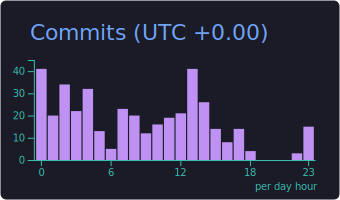

## 📊 GitHub Stats

> **概要**: 基本的な GitHub 統計情報（コミット数、スター数、フォロワー数、プルリクエスト数など）  
> **集計条件**: プライベートリポジトリを含む全コミット、全期間のデータ

  
  

  
  
  

## 📈 Detailed Analytics

> **概要**: より詳細な開発活動の分析（言語別リポジトリ数、コミット頻度、生産時間帯など）  
> **集計条件**: プライベートリポジトリを含む、過去 1 年間のコミット活動を基に自動生成

  
  

  

## Participated projects

### sky-app

- リポジトリ: https://github.com/webex14-team-3/sky-app
- 役割: フロントエンド開発
- 技術: Vue.js/Firebase

## Other

> **概要**: プロフィール閲覧数とソーシャルメディアリンク  
> **集計条件**: プロフィールページの訪問回数をリアルタイムでカウント

               

  

